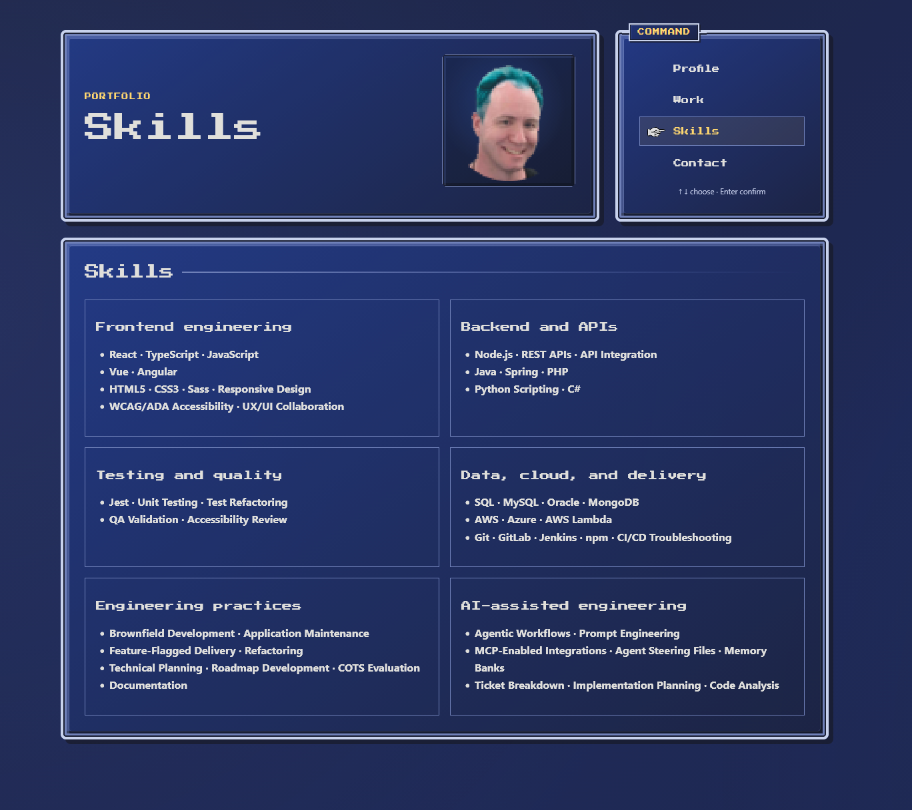

# Justin Green Portfolio

This is my personal portfolio, built with React and TypeScript and styled after the menu interfaces of classic JRPGs.

I wanted a relatively simple portfolio project as a starting point for building out my GitHub work, but I also wanted to use it as a test run for developing a clearer agentic development workflow with a strong UX focus.

I didn't want the site to just be another version of my résumé. I'm a video game fan and particularly interested in UX design in games, so I used that as an opportunity to give the portfolio some personality while still making sure it works like a normal, accessible website.

## Live Site

**[jgreen-portfolio.netlify.app](https://jgreen-portfolio.netlify.app/)**



## What I focused on

### Keeping the UX unique without sacrificing accessibility

One of the parts I'm happiest with is getting the JRPG-style interaction to work while still keeping normal web behavior.

Links are still links. Tab and Enter work normally. The command menu adds Arrow, Home, and End navigation, but those are enhancements rather than replacements for standard keyboard behavior.

The hand cursor is there to reinforce the game-inspired interface, but it isn't the only indication of focus or the current section.

Accessibility is important to frontend development, and I wanted it involved throughout the process instead of treated as something to add at the end.

### Avoiding unnecessary complexity

One concern I have with agentic development is how easily a relatively simple problem can become overengineered. It's easy to add abstractions, dependencies, or extra code when there's a simpler way to solve the problem.

For this project, local React state synchronized with URL fragments was enough to support navigation, direct links, bookmarks, and browser Back/Forward behavior. There wasn't a reason to add React Router, global state, a backend, or a larger content system just because those are common tools in React applications.

### Making the custom layout responsive

The interface uses CSS Grid and Flexbox without a UI framework.

The desktop layout keeps the JRPG-style status and command windows, while narrower screens reflow and resize the artwork without changing how the interface works.

Some of the responsive work also involved tracking down actual browser layout behavior, including CSS Grid intrinsic sizing that was causing horizontal overflow on mobile.

### Testing the behavior I cared about

I used Vitest and React Testing Library to cover the interactions most likely to break as the interface changed:

- URL fragment navigation
- Browser Back/Forward
- Keyboard movement and focus
- Active section versus focused command
- The hand cursor
- Transition behavior

I wasn't trying to maximize a coverage number. I wanted tests around the parts of the interface where the behavior actually mattered.

The site also respects `prefers-reduced-motion`, disabling the decorative background, cursor movement, and entrance animation without changing how the site works.

## Tech

- React
- TypeScript
- Vite
- CSS Modules
- CSS Grid / Flexbox
- Vitest
- React Testing Library
- Netlify

## Agentic development

I think of agentic development as another development tool. Like any tool, you need to understand where it helps, where it doesn't, and when you need to course correct.

One of my goals with this project was to experiment with that workflow and develop a more stable pattern for using coding agents. I used agents for things like implementation, review, debugging, and verification, while personally guiding the larger decisions around UX, architecture, accessibility, content, and visual direction.

A big part of the experiment was also learning when to tell the agent **not** to build something. Several passes on the project were specifically about removing unnecessary abstractions, simplifying generated code, or stopping before a larger technical decision was made.

I documented the workflow in [Human-Directed Agentic Development](docs/AGENTIC-DEVELOPMENT.md). The actual boundaries I used while working with coding agents are in [`AGENTS.md`](AGENTS.md).

## Running locally

```bash
npm install
npm run dev
```

Other useful commands:

```bash
npm run lint
npm run typecheck
npm test
npm run build
npm run format:check
```

## Professional content

I also wanted to avoid having an agent casually rewrite or embellish my work history while building a portfolio around it.

The rules I used for deciding which professional sources take precedence and what can or can't be changed are documented in [Professional Content Source of Truth](docs/PROFESSIONAL-CONTENT-SOURCE-OF-TRUTH.md).

Private résumé and working-source material are intentionally kept out of the repository.

## Licensing

Application source code is available under the [MIT License](LICENSE).

My personal portfolio content and artwork aren't included in that grant, and third-party fonts or assets retain their own licenses. More detail is available in [Licensing](docs/LICENSING.md).
